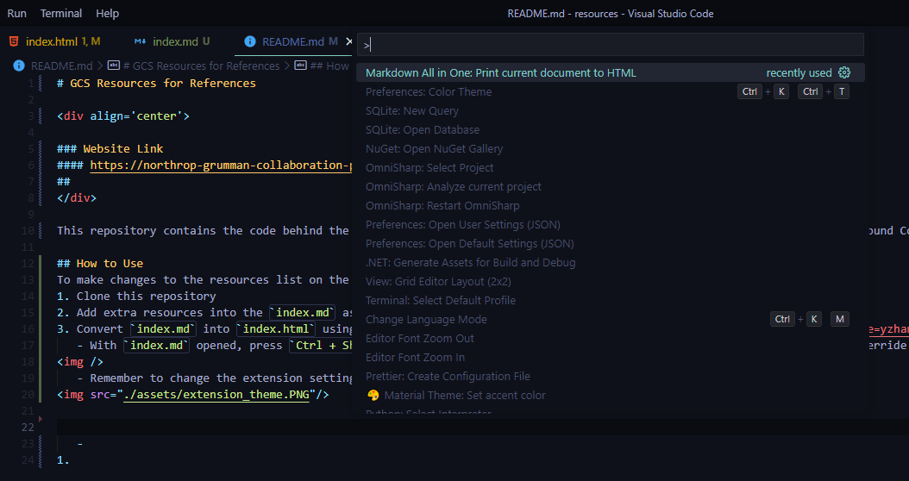
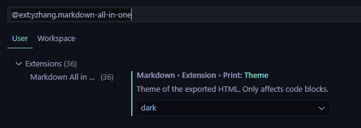

# GCS Resources for References

### Website Link
#### https://ngcp-project.github.io/gcs-resources-for-reference/
##

This repository contains the code behind the list of resources website that will come in handy for while developing the Ground Control Station.

## How to Make Changes
To make changes to the resources list on the website, follow the steps below:
1. Clone this repository
2. Add extra resources into the `index.md` as you pleased, using the Markdown format
3. Convert `index.md` into `index.html` using the [Markdown All in One](https://marketplace.visualstudio.com/items?itemName=yzhang.markdown-all-in-one) VS Code extension. 

   
   
   ###### With `index.md` opened, press `Ctrl + Shift + P`. Choose the option above to create a new `index.html` that will override the old one.     
   
   
   ###### Remember to change the extension settings to print in dark mode before printing

4. Push the final changes onto a separate branch on GitHub and make a pull request.
5. Once the pull request is approved, your changes should now be seen on the site itself. Congrats!
